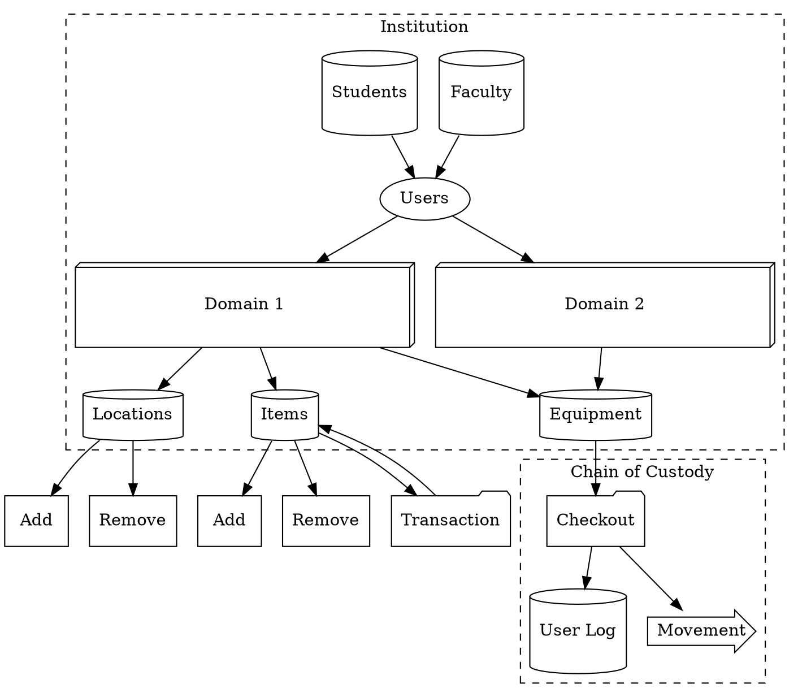

Labcatr is a web application which aims to solve problems with inventory management at the institution level. 

The project structure is as follows:

```dot
digraph G {
	subgraph cluster_0 {
		style=dashed;
		color=black;
		graph [pad=3]
		label = "Institution";
	
		"Faculty" [height=1,width=1, shape=cylinder, style=outline ]
		"Students" [height=1, width=1, shape=cylinder, style=outline ]
		"Domain 1" [height=1, width=4, shape=box3d]
		
		"Domain 2" [height=1, width=4, shape=box3d]

        Faculty -> Users
        Students -> Users
        Users -> "Domain 1"
        Users -> "Domain 2"
        
		
		"Domain 1" -> Locations;
		"Domain 1" -> Items;
		"Domain 1" -> Equipment
		"Domain 2" -> Equipment
	}
	
	subgraph cluster_1 {
		style=dashed;
		color=black;
		label = "Chain of Custody";
		
	    Equipment [ shape=cylinder, style=outline, height=0.6 ]
    	Equipment -> Checkout
    	Checkout -> "User Log"
    	Checkout -> "Movement"
	}
	
	Locations [ shape=cylinder, style=outline, height=0.6 ]
	Locations  -> locAdd
	Locations -> locRem
	Items [ shape=cylinder, style=outline, height=0.6 ]
	Items -> itemsAdd
	Items -> itemsRem
	Items -> Transaction
	Transaction -> Items
	
    locAdd [ label="Add", shape=box, height=0.6]
    locRem [ label="Remove", shape=box, height=0.6]
    
    itemsAdd [ label="Add", shape=box, height=0.6]
    itemsRem [ label="Remove", shape=box, height=0.6]
    
    Transaction [shape=folder, height=0.6]
    "User Log" [shape=cylinder, height=1]
    Checkout [shape=folder, height=0.6]
    Movement [shape=rarrow, width=1.2]
}
```

